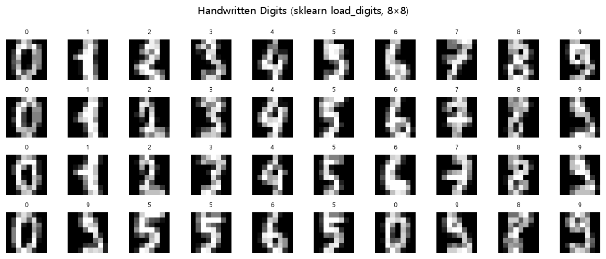
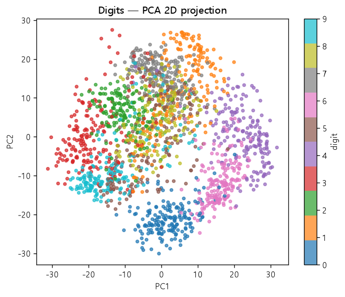

# 컴퓨터 비전 — CNN 이미지 분류

> **English summary** — A convolutional-neural-network portfolio for **image classification**, built with TensorFlow/Keras. It walks through the complete CV pipeline: designing a `Conv2D`-based network for **cats vs. dogs** binary classification, real-time **data augmentation** with `ImageDataGenerator` + `flow_from_directory`, loading/visualizing image tensors, training the cat/dog CNN with `ModelCheckpoint`/`EarlyStopping` callbacks and plotting learning curves, and a **handwritten-digit (MNIST)** multiclass classifier with a separate save/load-based prediction script. Everything is written with the Keras `Sequential` API and emphasizes an end-to-end, reproducible workflow from raw images to inference.


---

## 개요

NVIDIA AI Academy Seoul 부트캠프(1기)에서 **CNN 기반 컴퓨터 비전**을 학습하며 작성한 실습 코드 모음입니다. 이미지 데이터를 다루는 실전 흐름 — **CNN 설계 → 데이터 증강 → 학습(콜백) → 시각화 → 저장/예측** — 을 개·고양이 이진분류와 손글씨 숫자 다중분류 두 갈래로 다룹니다.

특징:

- Keras `Sequential` API로 **`Conv2D` + `MaxPooling2D` 블록을 직접 쌓아** CNN 설계
- `ImageDataGenerator`의 회전·이동 증강과 `flow_from_directory`를 이용한 **디렉터리 기반 배치 로딩**
- `ModelCheckpoint(save_best_only)` · `EarlyStopping(restore_best_weights)` 콜백으로 **best 모델 저장 및 과대적합 방지**
- 학습(loss/val_loss) 곡선을 matplotlib으로 **시각화 후 저장(savefig)**
- 학습 스크립트와 예측 스크립트를 분리해 저장된 `.keras` 모델로 **추론** 수행 (손글씨 숫자)

---

## 모델 & 실험

| 과제 | 데이터셋 | 모델 (핵심 레이어/구조) | 대표 파일 |
|---|---|---|---|
| 개·고양이 CNN 설계 | Cats vs Dogs (150×150×3) | `Conv2D(16)→Pool→Conv2D(32)→Pool→Conv2D(64)→Pool→Flatten→Dense(512)→Dense(1, sigmoid)` | [cat_dog_cnn_모델설계.py](src/20260615/cat_dog_cnn_모델설계.py) |
| 데이터 증강 | Cats vs Dogs | `ImageDataGenerator`(rescale·rotation 20°·height_shift 0.2) + `flow_from_directory`, 증강 이미지 저장 | [cat_dog_data_증강.py](src/20260615/cat_dog_data_증강.py) |
| 이미지 로드·시각화 | 단일 고양이 JPG | `image.load_img`→`img_to_array`→정규화→`imshow`/`savefig` (텐서 shape 확인) | [cats_imshow.py](src/20260615/cats_imshow.py) |
| 개·고양이 CNN 학습 | Cats vs Dogs (train/test) | 위 CNN + `binary_crossentropy`, 제너레이터 학습(`steps_per_epoch`), 콜백, loss 곡선 시각화 | [cnn_cats_and_dogs_모델학습.py](src/20260615/cnn_cats_and_dogs_모델학습.py) |
| 손글씨 숫자 분류 | sklearn `load_digits` (8×8, 10클래스) | `Conv2D(32)→Pool→Conv2D(64)→Pool→Flatten→Dense(100)→Dropout→Dense(60)→Dense(10, softmax)`, 콜백 | [손글씨이미지_분류.py](src/20260615/손글씨이미지_분류.py) |
| 손글씨 예측/추론 | sklearn `load_digits` | 저장된 `mnist_bestmodel.keras` 로드 후 검증 샘플 예측(예: 6 → 6) | [손글씨이미지_분류_예측.py](src/20260615/손글씨이미지_분류_예측.py) |

---

## 결과

### 손글씨 숫자 데이터 시각화 (실제 출력)

저장소가 다루는 8×8 손글씨 숫자(`load_digits`)를 시각화한 실제 결과입니다. (`results/`)

| 숫자 샘플 그리드 | PCA 2D 투영 (클래스 분리) |
|:---:|:---:|
|  |  |

원본 8×8 이미지를 그리드로 확인하고, PCA로 2차원에 투영하면 숫자 클래스들이 특징 공간에서 어느 정도 분리되는 것을 볼 수 있습니다 — CNN이 학습하기 좋은 구조임을 시사합니다.

### 그 외 (CNN 학습 산출물)

- **개·고양이 CNN** — `ImageDataGenerator` 증강 배치를 제너레이터로 학습, `EarlyStopping`으로 조기 종료 후 best 모델 저장, Train/Val loss 곡선을 `catdog_model.jpeg`로 저장.
- **데이터 증강** — 회전·이동으로 변형된 이미지를 `save_to_dir`에 저장해 증강 효과 확인.
- **손글씨 CNN** — digits를 CNN으로 학습해 예측 스크립트로 검증.

> 개·고양이 데이터셋은 용량 문제로 저장소에 포함하지 않아 CNN 학습 곡선은 코드 기준으로만 서술합니다(외부 데이터 필요). 위 숫자 시각화는 `results/` 생성 코드의 실제 출력입니다.

---

## 실행 방법

```bash
# 1) 의존성 설치
pip install -r requirements.txt

# 2) 개·고양이 CNN 학습 (데이터셋 디렉터리 필요)
python src/20260615/cnn_cats_and_dogs_모델학습.py

# 3) 손글씨 숫자 분류 학습 → best 모델 저장
python src/20260615/손글씨이미지_분류.py

# 4) 저장된 모델로 손글씨 예측/추론
python src/20260615/손글씨이미지_분류_예측.py
```

> 개·고양이 데이터셋 경로는 학습 당시 환경(`/home/sckit/...cnn_cats_and_dogs_dataset/train|test`) 절대경로로 작성되어 있습니다. 실행 시 본인 환경의 `train/`·`test/` 디렉터리 경로로 수정하세요. 손글씨(`load_digits`) 데이터는 scikit-learn에서 자동 로드됩니다.

---

## 배운 점

- **CNN 블록 구성 원리**: `Conv2D`(특징 추출) → `MaxPooling2D`(다운샘플링) 블록을 반복해 채널을 늘려가며(16→32→64) 계층적 특징을 학습하는 구조를 이해했습니다.
- **입력 shape 설계**: 컬러 이미지는 `(150,150,3)`, 흑백 digits는 `(8,8,1)` 처럼 채널 수를 정확히 맞춰야 한다는 점을 익혔습니다.
- **데이터 증강의 효과**: 데이터가 부족할 때 `ImageDataGenerator`의 회전·이동으로 일반화 성능을 높이고, `flow_from_directory`로 폴더 구조만으로 라벨링·배치 로딩을 자동화할 수 있음을 배웠습니다.
- **제너레이터 학습**: `fit(train_data_gen, steps_per_epoch=...)` 처럼 스텝 기반으로 대용량 이미지를 메모리 효율적으로 학습하는 방식을 습득했습니다.
- **학습/추론 분리**: best 모델을 저장하고 별도 스크립트에서 `load_model`로 불러와 예측하는 재현 가능한 파이프라인을 구성했습니다.

---

## 참고

- 자매 저장소 — [**deep-learning-keras**](https://github.com/NvidiaSeoul/deep-learning-keras) : TensorFlow·Keras 딥러닝 기초(회귀·분류·배치정규화·오토인코더)
- 자매 저장소 — [**machine-learning-sklearn**](https://github.com/NvidiaSeoul/machine-learning-sklearn) : scikit-learn 기반 고전 머신러닝
- [NVIDIA AI Academy Seoul (NvidiaSeoul)](https://github.com/NvidiaSeoul)

---

> NVIDIA AI Academy Seoul · Cohort 1 포트폴리오의 일부 — [전체 보기](https://github.com/NvidiaSeoul)
